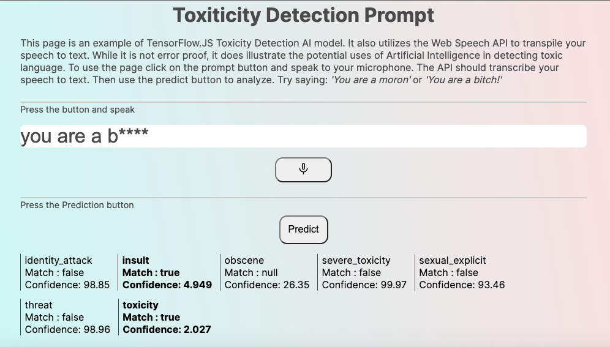

# TensorFlow.JS_Toxicity_Detector

## Description

This page is an example of TensorFlow.JS Toxicity Detection AI model. It also utilizes the Web Speech API to transpile your speech to text. While it is not error proof, it does illustrate the potential uses of Artificial Intelligence in detecting toxic language. To use the page
click on the prompt button and speak to your microphone. The API should transcribe your speech to text. Then use the predict button to analyze.
Try saying: **'You are a moron'** or **'You are a bitch!'**

## Table of Contents

- [Installation](#installation)
- [Usage](#usage)
- [ScreenShot](#screenshot)
- [License](#license)
- [Contributing](#contributing)
- [Tests](#tests)
- [Questions](#questions)

## Installation

N/A

## Usage

It is meant to be viewed online. You must enable your microphone

## ScreenShot

## License

This project is covered under the following: MIT License

## Contributing

Submit a GitHub Issue.

## Tests

N/A
